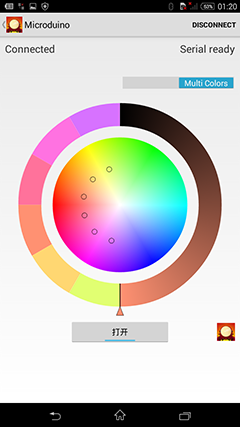
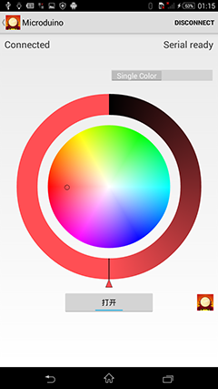
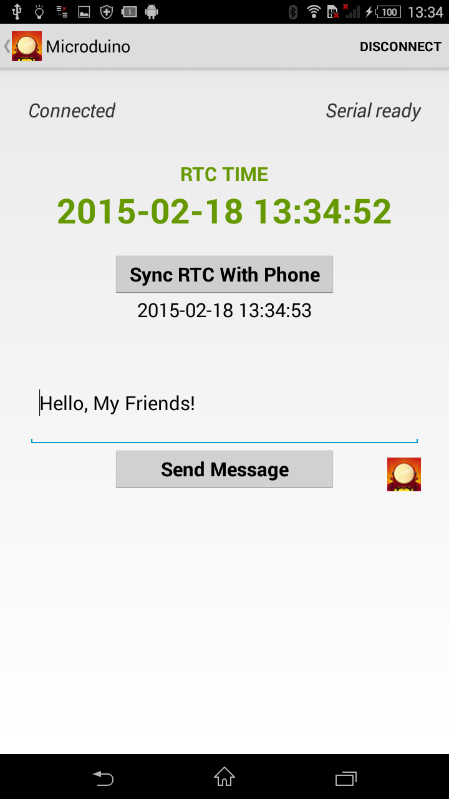

# README

Android App for Microdino.

These Apps are always communicating Microduino via BLE.

## ble-led

Android APP control Microduino LED Board.
Tested on Android 4.3(Samsung S3) and 4.4(Sony Xperia).

You need 4 modules at least: Core, BT, LED, and USBTTL.

1. Stack them together,
2. upload the sketch vis USBTTL,
3. Play Android App.\n"

### Screens

## ble-clock

Android APP control Microduino RTC, Sync RTC time with Phone.
Tested on Android 4.3(Samsung S3) and 4.4(Sony Xperia).

You need 4 modules at least: Core, BT, RTC, and USBTTL.

1. Stack them together,
2. upload the sketch vis USBTTL,
3. Play Android App.

### Screens
