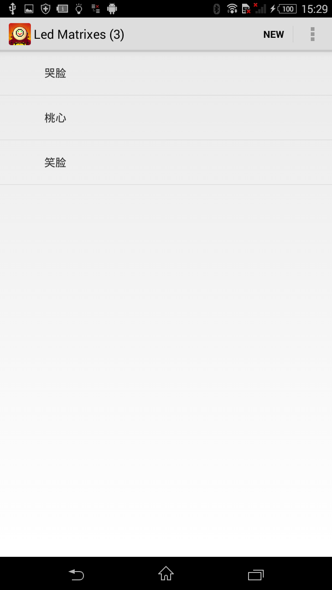
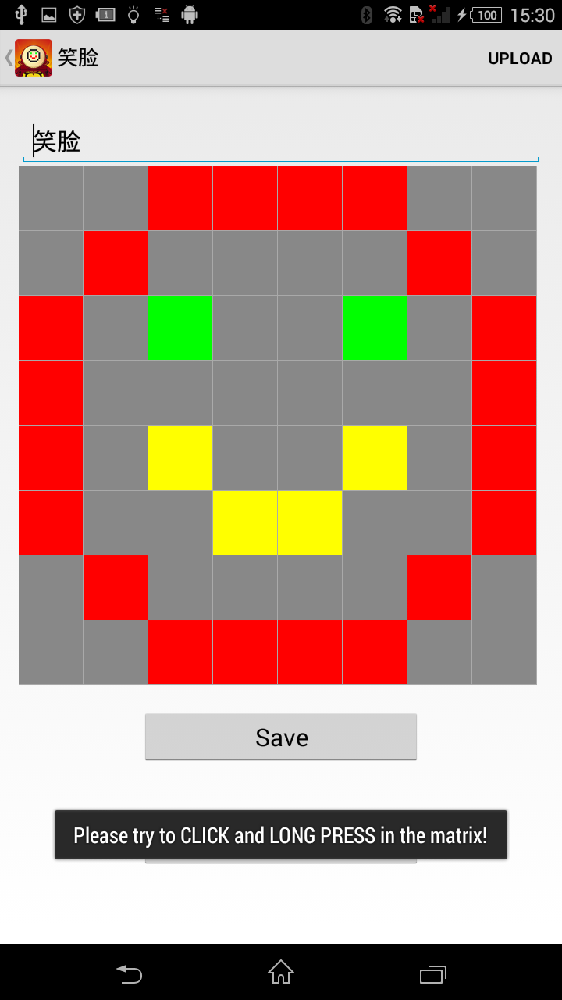
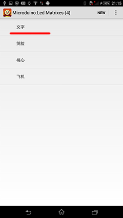
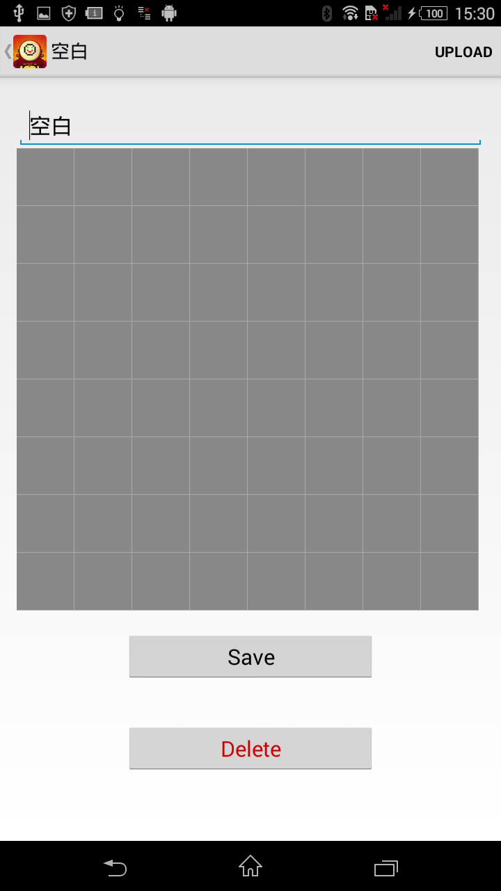
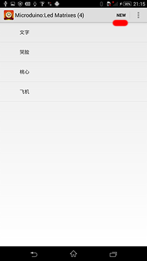
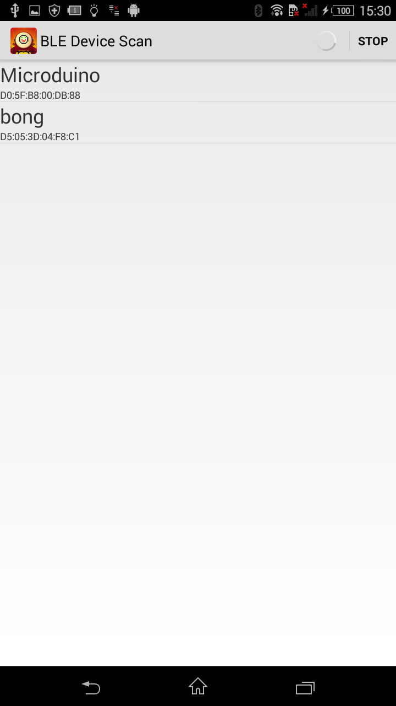
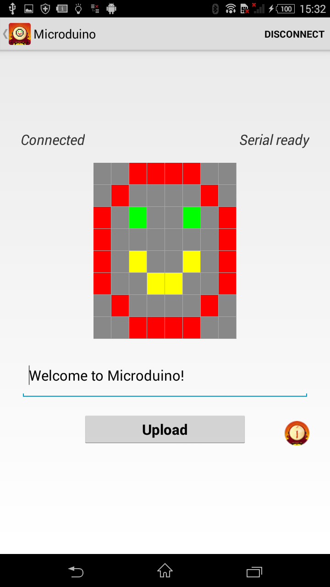
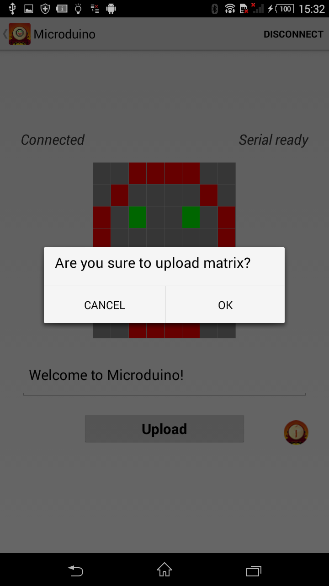
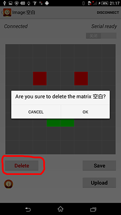
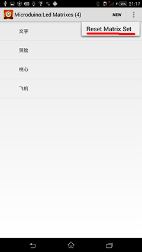

# README

## ble-8x8ledpad

Control 8x8 LEDPad.
Tested on Android 4.4(Sony Xperia).

Home page is select BLE device. 

List of LED matrix

Click first item "Text", You can upload text message.

Click "NEW" button on the top-right conner, create new matrix.

You can draw something by **CLICK** the led matrix on screen. If you want to clean the button, just **CLICK AGAIN**. **LONG PRESS** will change color. There are 3 colors : Red, Yellow, Green.

On the top-right cornor you can find a switch to change draw mode. If the switch is **Draw**, the changes on phone screen will send to LED Pad one by one. If the switch is **OFF**, you need press the "Upload" button to refresh LEDPad. 

You can save or delete a matrix.

If you want to reset all matrix to factory setting, please select meanu "Reset Matrix Set". 

### LEDPad Control Protocol

Send text message

	// <color index> value is in [1,2,3], means [Red, Yellow, Green]
	// <direction index> value is in [0,1,2,3], means [Left, Up, Right, Down]
	// <message> is text string.

	M:<color index>,<direction index>,<message>\n
	
	M:2,0,Welcome to Microduino!\n   // Yellow text "Welcome to Microduino!", scroll from Left to Right
	
Send color matrix

	// 64 charactors <color index> for each LED on 8x8 LEDPad
	
	B:<color index matrix>\n
	
	B:0011110001000010103003011000000110200201100220010100001000111100\n		// Smile Face
	
Change color of a led

	// <row>, <column> is the postion, value is in [0-7] 
	
	L:<row>,<column>,<color index>\n
	
	L:2,7,3\n		// On the 3rd row, 8th column, set Green Color
