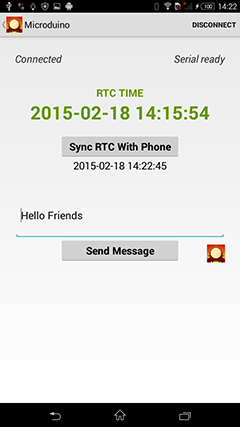

# README

## ble-clock

Sync RTC time with Phone.

Android APP control Microduino RTC, 
Tested on Android 4.3(Samsung S3) and 4.4(Sony Xperia).

You need 4 modules at least: Core, BT, RTC, and USBTTL.

1. Stack them together,
2. upload the sketch vis USBTTL,
3. Play Android App.

