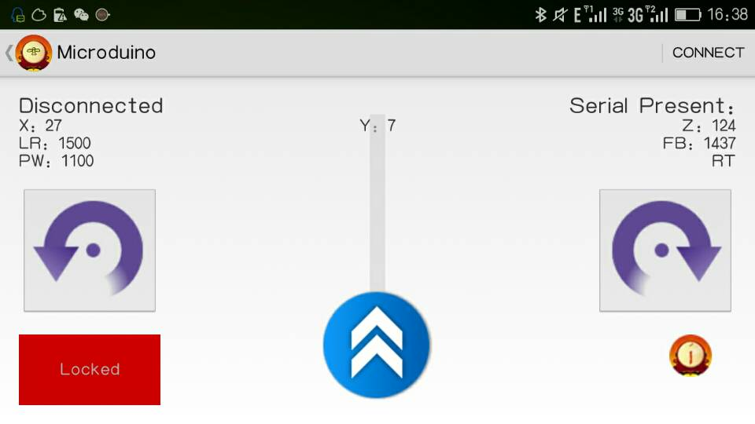

# README

## ble-copter

Android APP control Microduino Quadcopter(USe BLE Module). You can use it to replace Joypad. 
Tested on Android 4.4.

This App use gravity sensor to control Quadcopter.

1. Place the phone with screen upside. 
2. Click the unlock button.
3. Push up the power bar to make Quadcopter fly.
4. Tilt to left, right, forward, or backword.
5. Click the rotate button to rotate Quadcopter.
6. Click Lock button to finish this fly. 

