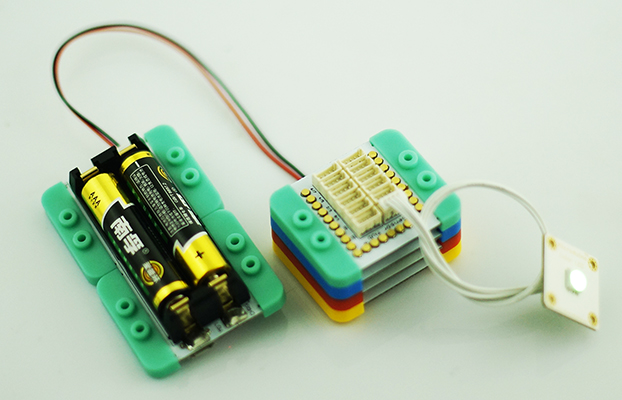
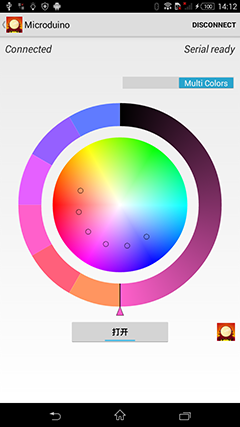
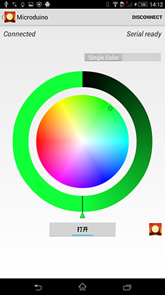

# README

## ble-led 

Android APP control Microduino LED Board.
Tested on 4.4.2.

### Version 2.1 for mCookie

1. Revised the UI for Microduino
2. Revised the sketch file compatiable with mCookie

You need these modules:  

CoreUSB, Bluetooth, SensorHub, BM and Color LED.

### Version 2

Enhanced function with single color mode.

1. Add White color button
2. Add Sun Color button
3. Add Listen music mode, the led will flash follow music. 

### Version 1 

Control the led with single color or multi color.

