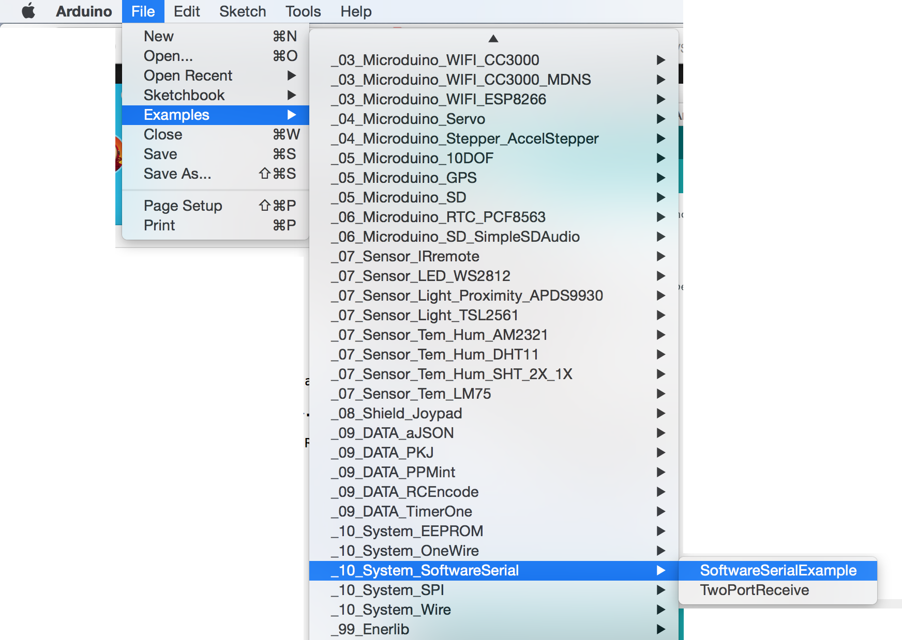

# README

## mSerial

BLE Serial Reader／Writer with Phone.

Exchange text message with Android APP and Microduino BLE SoftSerialSample

Tested on Android 4.4.2.

You need 3 modules at least: Core, BT and USBTTL.

1. Stack them together,
2. upload the sketch vis USBTTL,
3. Play Android App.

## Related Arduino Sketch

Please use this SoftSerialSample in Arduino IDE for Microduino, change all wavebaud to 9600

    Serial.begin(9600);
    ...
    // set the data rate for the SoftwareSerial port
    mySerial.begin(9600);

