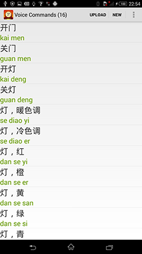
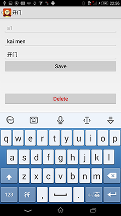
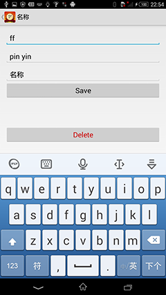
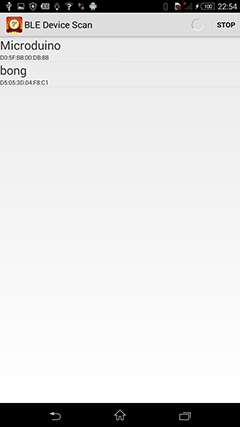
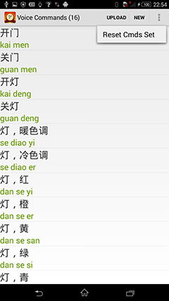

# README

## ble-voice

Manage the commands of voice controller.
Tested on Android 4.4(Sony Xperia).

Home page is voice commands list. 

Click each item, will enter the command editor.

Click "NEW" button on the top-right conner, create new command.

Click "UPLOAD" button on the top-right conner, will start voice commands set uploading process. Select your Microduino ble device, then upload the commands.

If you want to reset all commands to factory setting, please select meanu "Reset Cmds Set". 

